+++
title = "HGAME2018-week1WP"
date = 2018-02-08T10:17:34+08:00
updated = 2020-08-07T01:48:37.522860+08:00
description = "HGAME2018-week1WP"
in_search_index = true

[taxonomies]
tags = [ "CTF", "Web", "Rev", "PWN", "Misc", "Crypto",]
categories = [ "WriteUp",]
archives = [ "archive",]
+++
第一周难度还是挺温柔，居然让我AK了，好开心呀

对了，这篇是先在本地生成的，周日才传上博客的。

<!-- more -->

# Web

## Are you from Europe?

第一次做这种题，还学到了一点浏览器console的用法……
直接看源码，最开始发现在F12的console里输入quartz +=100000000有用
然后很开心地抽卡，抽了半天感觉不对，仔细看了下概率……淦哦我是不是傻

翻到最底下有个函数，看着就是和flag有关的样子
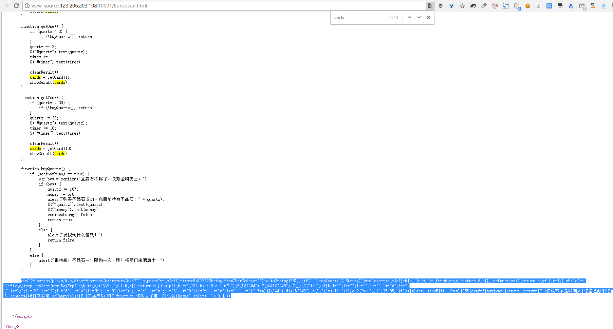
代码美化一哈
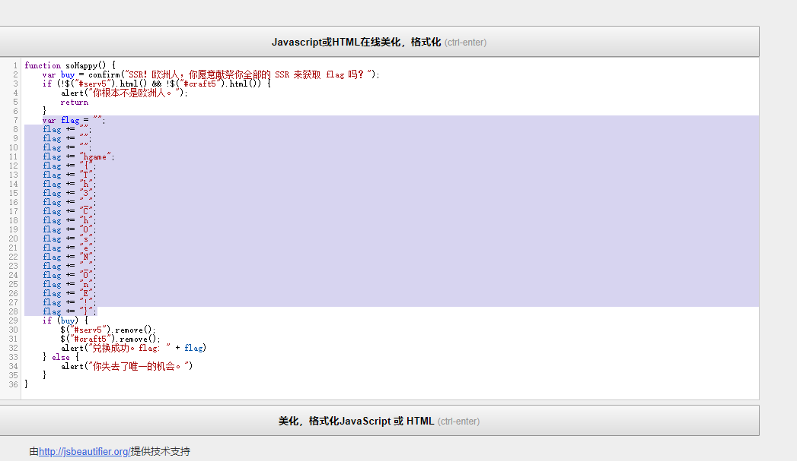

## special number

源码已经放了出来
```PHP
include_once("flag.php");
if(isset($_GET['key'])){
    $pattern = '/^(?=.*[0-9].*)(?=.*[a-zA-Z].*).{7,}$/ ';
    $key = $_GET['key'];
    if(preg_match($pattern,$key)===0){
        echo "格式错误";
    }else{
        $lock="******************";
        $b = json_decode($key);
        if($b==$lock)
            echo $flag;
        else
            echo "this is no special number";
    }
}
```
这个题的考点就是PHP弱类型中0==string这个情况（PHP混乱邪恶无疑
就是要让json_decode出来的结果是0，于是在沙盒http://sandbox.onlinephpfunctions[.]com/里实验出了结果
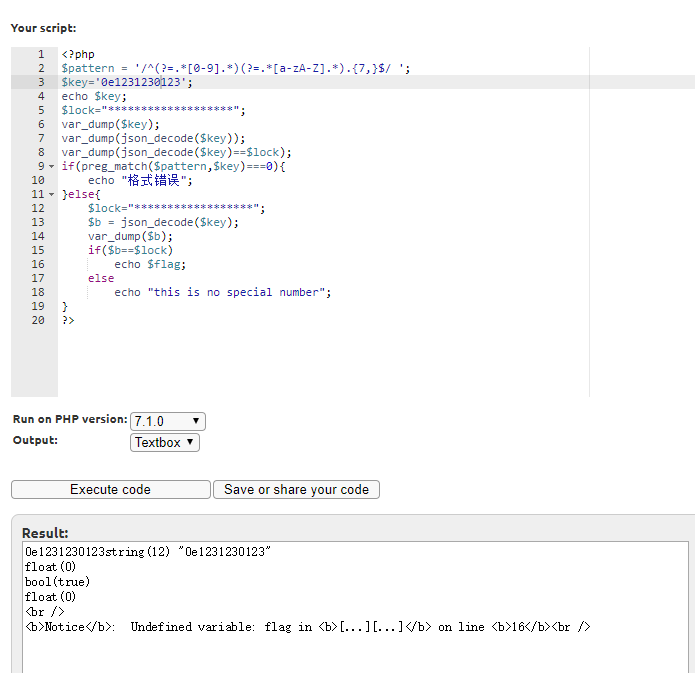
然后去原网页的时候还失败了一次……
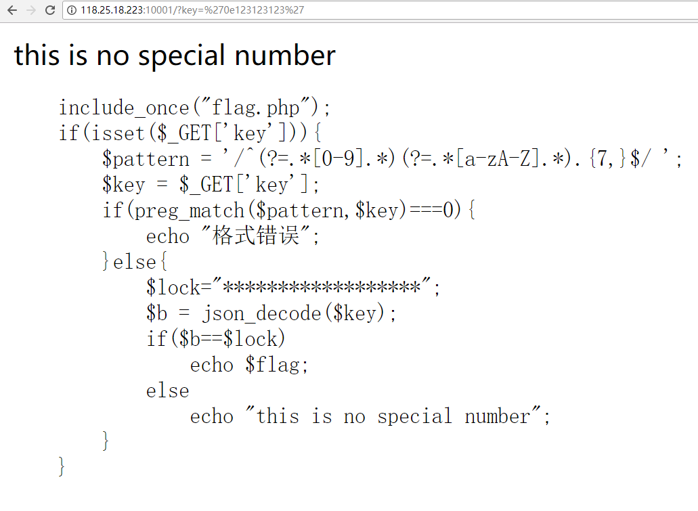
因为传入的时候会再加对引号……
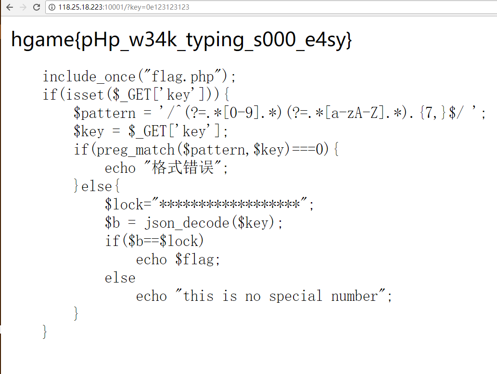
这里必须感谢一下飘零大大指点的，一开始光想着怎么绕过正则，反而偏离了正轨
顺便正则的效果大概是需要传入的字符串既有数字又有字母长度大于6就行

## can u find me?

> Description 
> only robot know where is the flag

那当然是robots.txt啦，这不是送？

直接访问看到

抓包看看，发现Cookie里有个user=
补上，发出，得flag
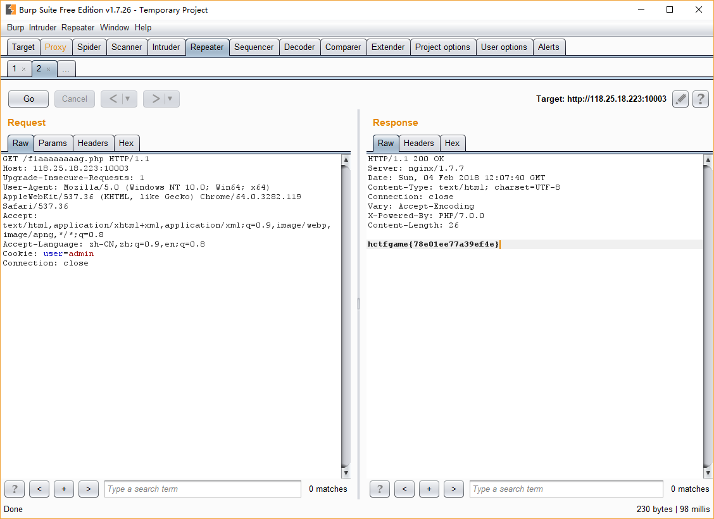

## tell me what you want

这个题就是纯练改HTTP头的
点进去问你想要啥，你输flag告诉你用POST更好，然后之后每改一次都会告诉你新的要改的地方，全改完得到flag
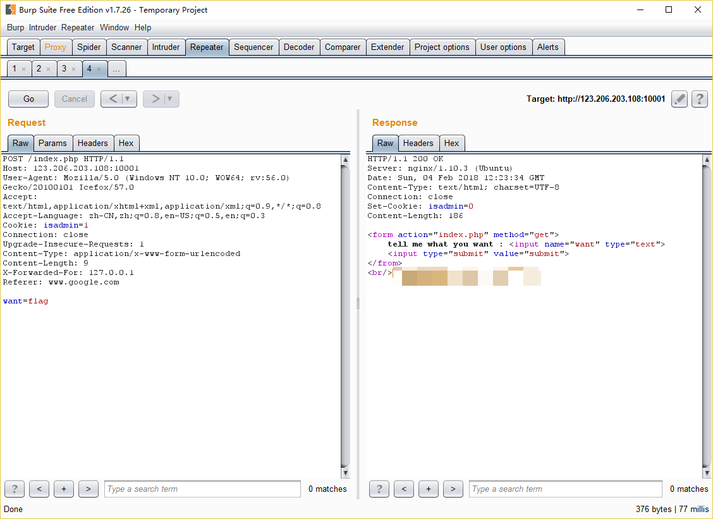

## 我们不一样
还是源码放出，还是弱类型
```PHP
include_once("flag.php");
if (isset($_POST['str1']) && isset($_POST['str2'])) {

	if ($_POST['str1'] != $_POST['str2'] && strcmp($_POST['str1'], $_POST['str2']) == 0) {
		echo "flag is:".$flag;
		exit();
	} else {
		echo "Something wrong..";
	}
}
```
这里的弱类型在于string和非string的strcmp返回0，而array!=string成立
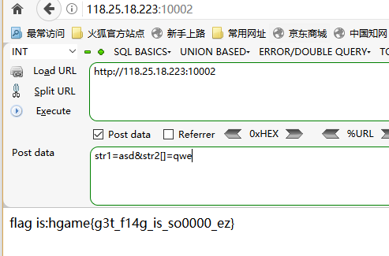

# Rev

## re0
拖进IDA，F5出flag
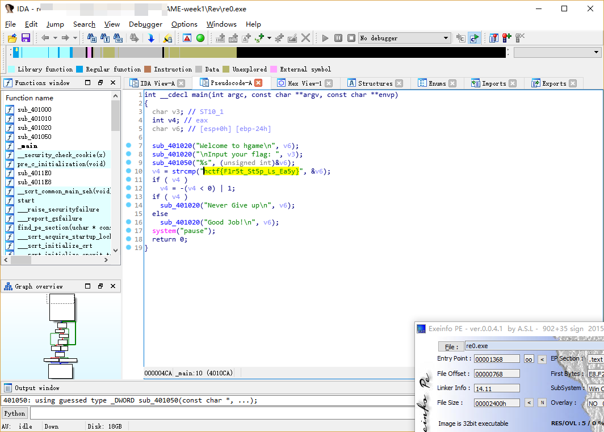

## baby_crack

拖进IDA，F5，读代码。发现对操作做了这样的操作：
- 按位置进行循环移位
- 将输入的每个通过一个映射转到另一个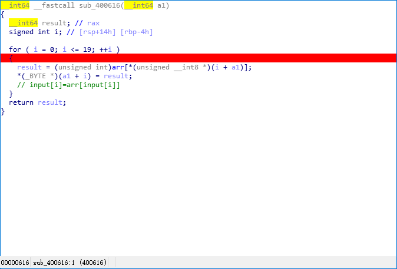
- 进行几轮交换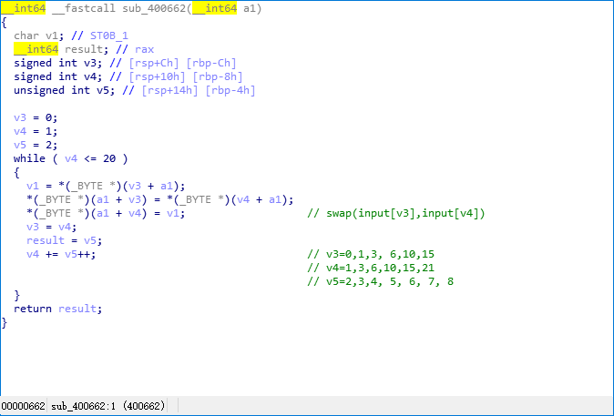
- 与flag进行同意操作得到的结果进行比较
  于是写出反着来的操作
```cpp
//baby1.cpp
#include <bits/stdc++.h>
using namespace std;
int indx[]={17,191,186,15,213,204,188,30,25,1,135,27,150,195,134,26,126,107,90,141,251,194,139,179,177,221,239,10,75,248,85,38,118,171,193,100,23,201,175,97,103,74,202,18,36,225,174,80,58,112,55,237,224,119,183,46,161,45,50,123,137,207,240,148,33,101,11,63,125,41,59,5,81,231,129,110,51,198,215,172,60,154,34,220,122,8,106,151,241,95,142,98,111,19,138,130,140,42,73,57,24,104,208,131,180,66,54,113,12,87,16,243,40,212,52,14,228,255,6,173,92,252,219,222,218,159,234,53,94,120,82,217,79,109,187,168,176,21,67,144,37,166,84,254,13,235,169,253,233,93,22,203,47,78,189,197,9,70,247,192,31,89,211,2,35,157,96,4,132,246,164,29,49,76,200,155,199,223,102,44,236,121,115,48,105,99,149,214,190,68,232,165,242,153,216,56,160,227,143,210,83,61,86,146,114,250,184,167,205,238,147,133,108,127,170,178,71,206,128,32,28,124,7,226,185,145,69,116,152,245,62,3,196,65,1,43,72,39,230,91,244,156,136,117,162,182,20,209,229,77,64,249,158,88,163};
int arr[]={166,78,5,162,182,8,162,206,140,238,32,194,152,160,208,205,35,166,106,130};
int main()
{
//	int a;
//	while(cin>>a){
//		cout<<indx[a]<<endl;
//	}
	for(int i=0;i<20;++i){
		for(int j=0;j<256;++j){
			if(indx[j]==arr[i]){
				cout<<int(*(char*)(&j))<<',';
			}
		}
	}
	return 0;
}
```
```cpp
//baby2.cpp
#include <bits/stdc++.h>
using namespace std;
int arr[]={141,153,71,245,246,85,245,217,96,209,219,21,228,196,102,208,164,141,86,95};
int main()
{
//	for(int i=0;i<20;++i){
//		newa[indx[i]]=arr[i];
//	}
//	for(int i=0;i<20;++i){
//		cout<<newa[i]<<',';
//	}
	swap(arr[10],arr[15]);
	swap(arr[10],arr[6]);
	swap(arr[6],arr[3]);
	swap(arr[3],arr[1]);
	swap(arr[0],arr[1]);
	for(int i=0;i<20;++i){
		printf("%d,",arr[i]);
	}
	return 0;
}
```
```cpp
//baby3.cpp
#include <bits/stdc++.h>
using namespace std;
uint8_t arr[]={208,141,71,153,246,85,245,217,96,209,245,21,228,196,102,219,164,141,86,95};
unsigned char flg[22]="";
int main()
{
	for(int i=0;i<20;++i){
		bitset<8> a(arr[i]);
		cout<<a<<endl;
		if(i%4==1){
			a=(a<<6)|(a>>2);
		}else if(i%4==2){
			a=(a>>4)|(a<<4);
		}else if(i%4==3){
			a=(a<<2)|(a>>6);
		}else{
			a=(a>>1)|(a<<7);
		}
		cout<<a<<' '<<a.to_ulong()<<endl;
		flg[i]=a.to_ulong();
	}
	for(int i=0;i<20;++i){
		cout<<char(flg[i]);
	}
}
```

这里需要说一下……
C/C++的左右移有毒！换bitset保平安！

## nop_pop
一月霸权当然是我pop team epic啦！食我粪作！
EXEinfo显示是PE文件，那就运行一下看

打开OD搜一下
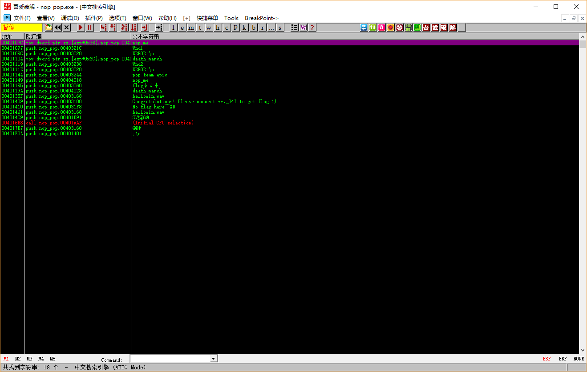
先是把跳转nop掉，然后出来那个Con...的，联系出题人，出题人表示是要nop掉pop子
于是再看，然后发现上面有个nop_me（提示真明显wwwww）
nop掉，程序发给出题人，得到flag

## sc2_player

看了一下程序F5出来的东西大概做了这几步操作
- arr=(index%7+35)^special
- special(index%7)=special^0x34
- arr=input^ index^(index/7)
  这几个都是长度为28的数组，arr是最后用来比对的数组，input是输入的flag，special是一个程序存储的数组
  所以前两步有什么意义……
```cpp
//sc2.cpp
#include <bits/stdc++.h>
using namespace std;
char arr[29]={104,98,118,101,127,72,50,127,86,124,99,63,82,101,72,108,77,116,101,32,114,115,74,96,115,127,124,101};
int main()
{
	for(int i=0;i<28;++i){
		arr[i]=arr[i]^i^(i/7);
	}
	for(int i=0;i<28;++i){
		putchar(arr[i]);
	}
}
```
# PWN

前两题做的时候不在家，借朋友电脑用了下

## guess_number
其实是很明显的溢出，scanf这个东西不安全，可以直接覆盖到比较的数字


## flag_server
还是输入超限，不过一开始要输入长度而且还不能大于63，后面的对比又用!=（继续吐槽我那个超喜欢用!=的队友
所以输入一个负数就好了
然后就可以覆盖到猜测的数字了
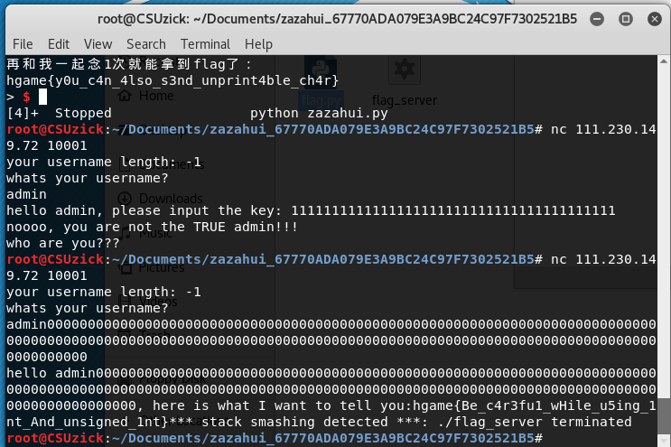

## zazahui
先看整个流程，发现它先把flag读进了一个固定地址
这次换成了read，但是大小却是188，于是还是能搞事，直接用地址覆盖后面的\*s就能输出flag了

本机测试过关直接发payload了，顺便\*s后面是计数器，所以可以覆盖可以不覆盖，但是不能改成0，那样就直接退出了
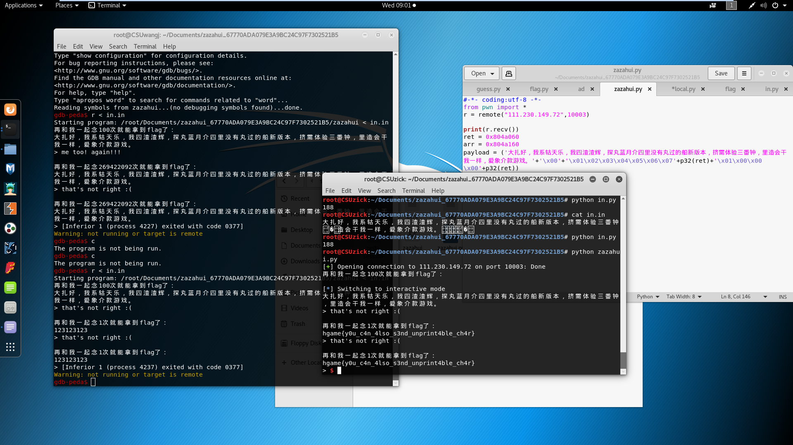

# Misc

## 白菜1
先用stegsolver打开看了一遍，都没东西
于是考虑lsb（算是常规套路了吧）
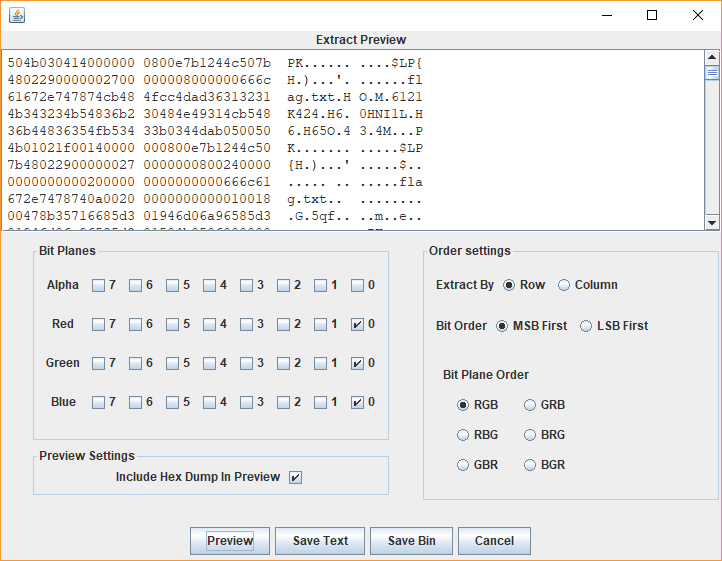
然后文件头不熟练的我还跑了下binwalk,wwwwwww
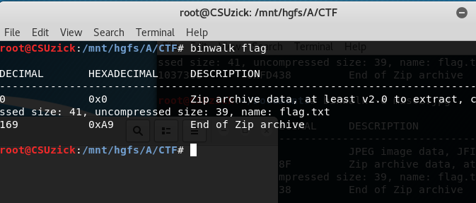
就是个zip包，解压出来就是flag

## 白菜2
跑一下binwalk，发现有东西
然后就得到了flag
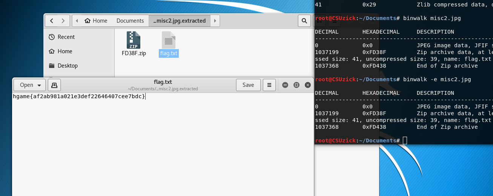

## pacp1
搜下flag
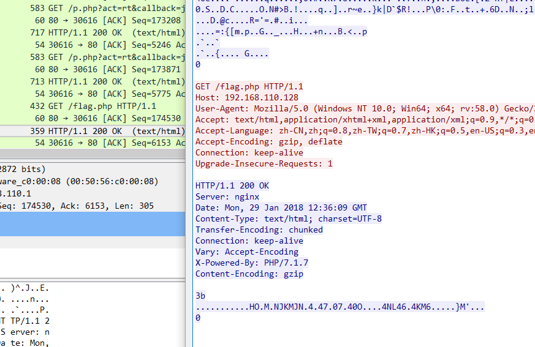
看最后这个返回200的分组
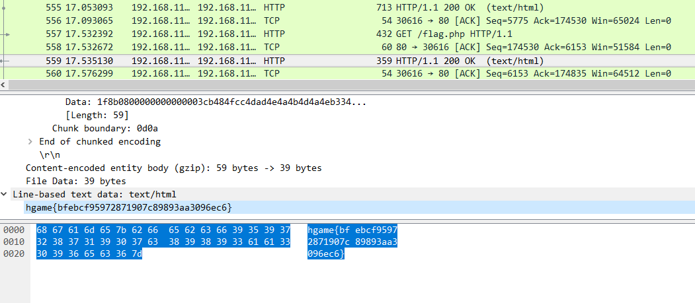

# Crypto
知识点全部给出来了哇，真系给力
## easy Caesar
一开始题目还有错，于是找出题人说，拿到了1血（然而改错没加分wwww）
直接上工具

然后数字也有变过，那么按照常识判断，就是qu1ck,4x,la2y,br0wn
于是有了flag
## Polybius
看到的时候就反应过来了，可惜当时没找到工具手解的……
看它给的提示网址https://www.wikiwand[.]com/en/Polybius#/Cryptography就行了，这种出题真的很照顾人了
## Hill
学到了一种新的加密方式，不过要算数论中矩阵的逆，如果阶数高了，感觉就是灾难啊……
顺便我又没找到工具一开始还没仔细看链接，矩阵的逆还是手算的……淦了
同样的https://www.wikiwand[.]com/en/Hill_cipher

## confusion
这个题就比较舒服，不就是大杂烩嘛，上工具~
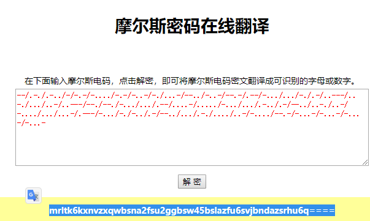
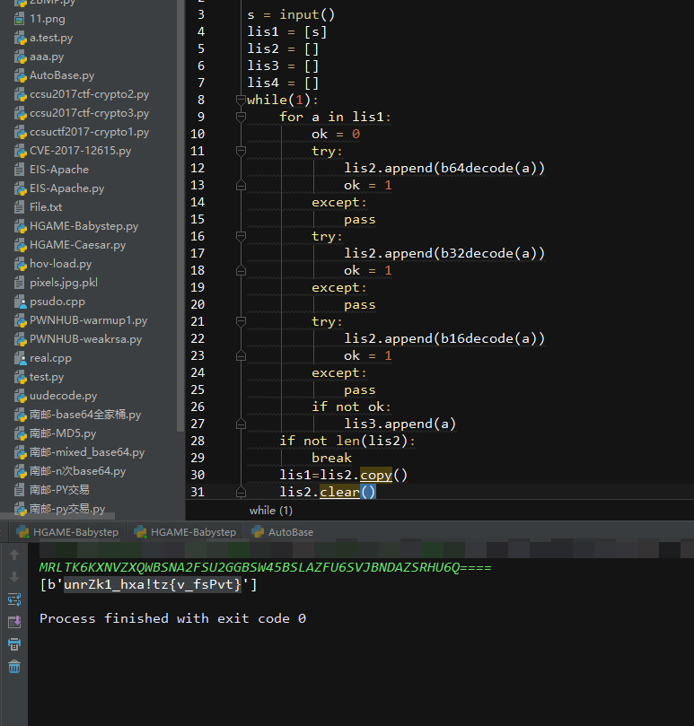
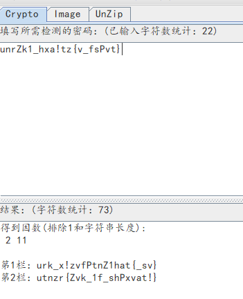
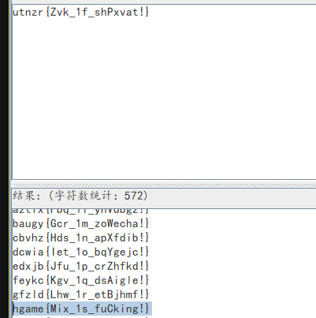
## baby step
刚学完密码学，然而不想自己手写
网上直接找的python脚本太腊鸡了……慢得不行
最后换ACM大佬博客找的就好了
解出来基础解是191091022097，然后加上i个0x1111111111模0x976693344d的逆元就好，顺便后面这个数是质数，所以逆元可以用费马小定理算