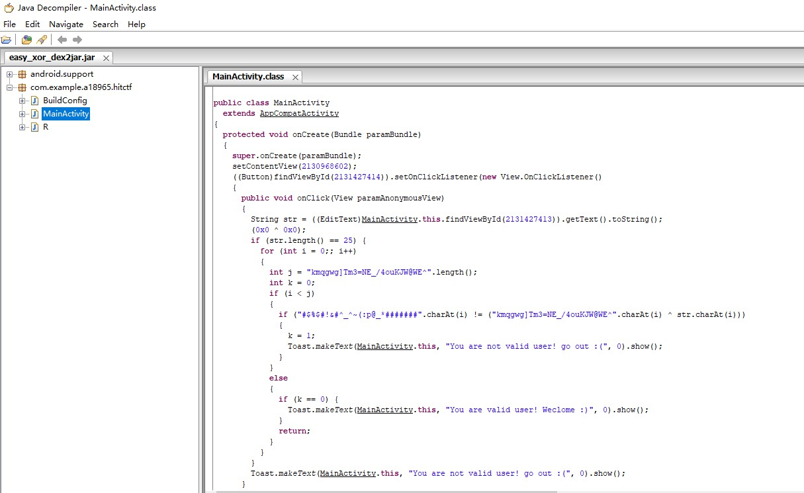
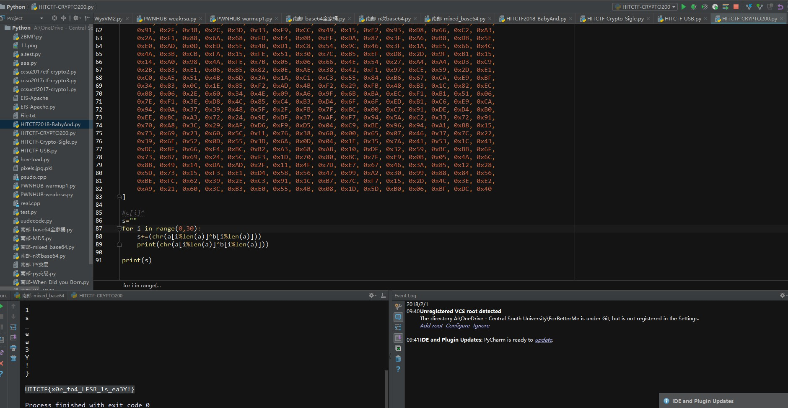
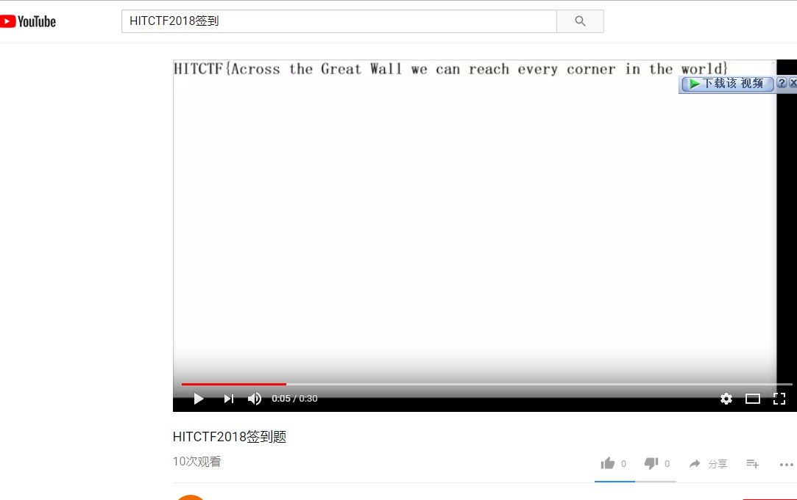
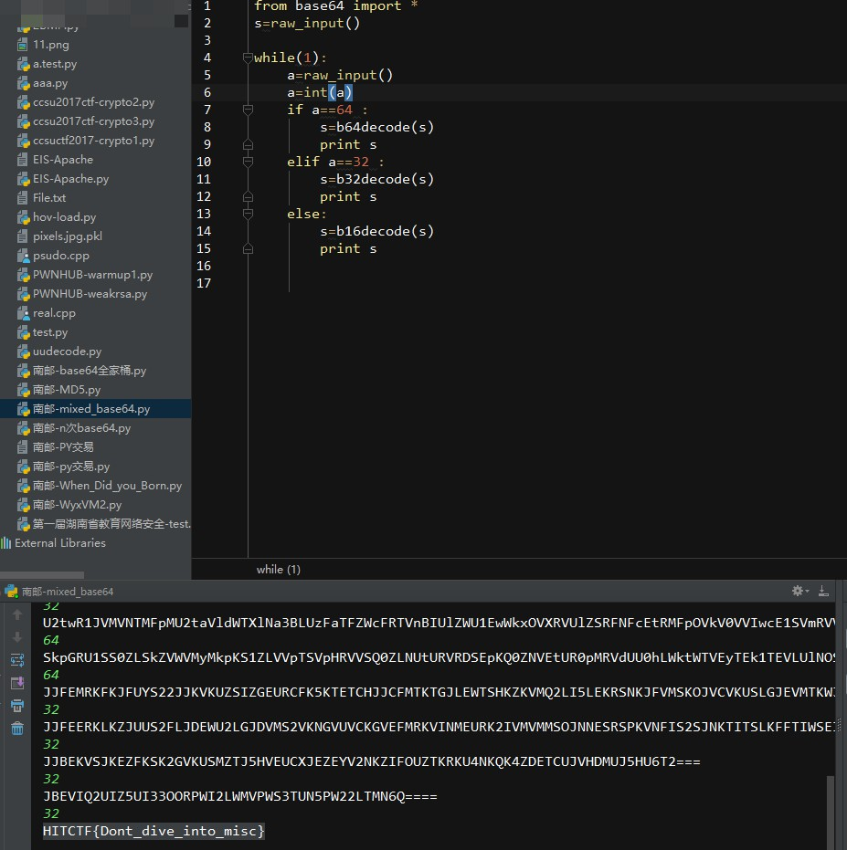
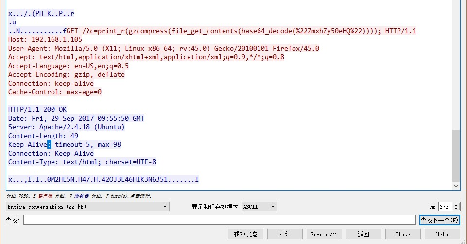
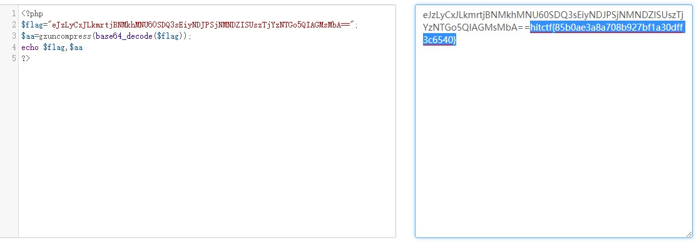
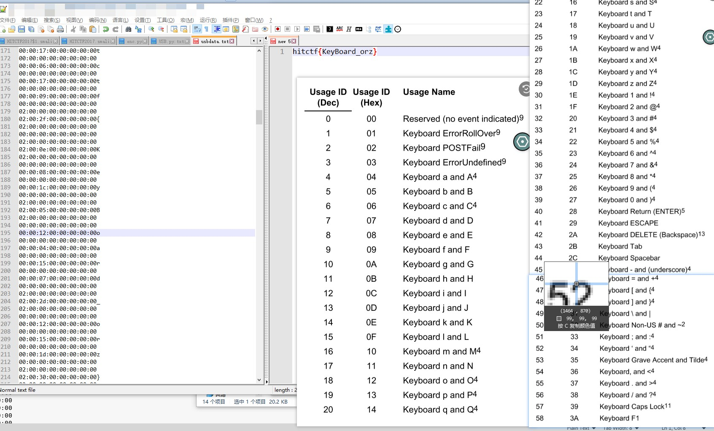
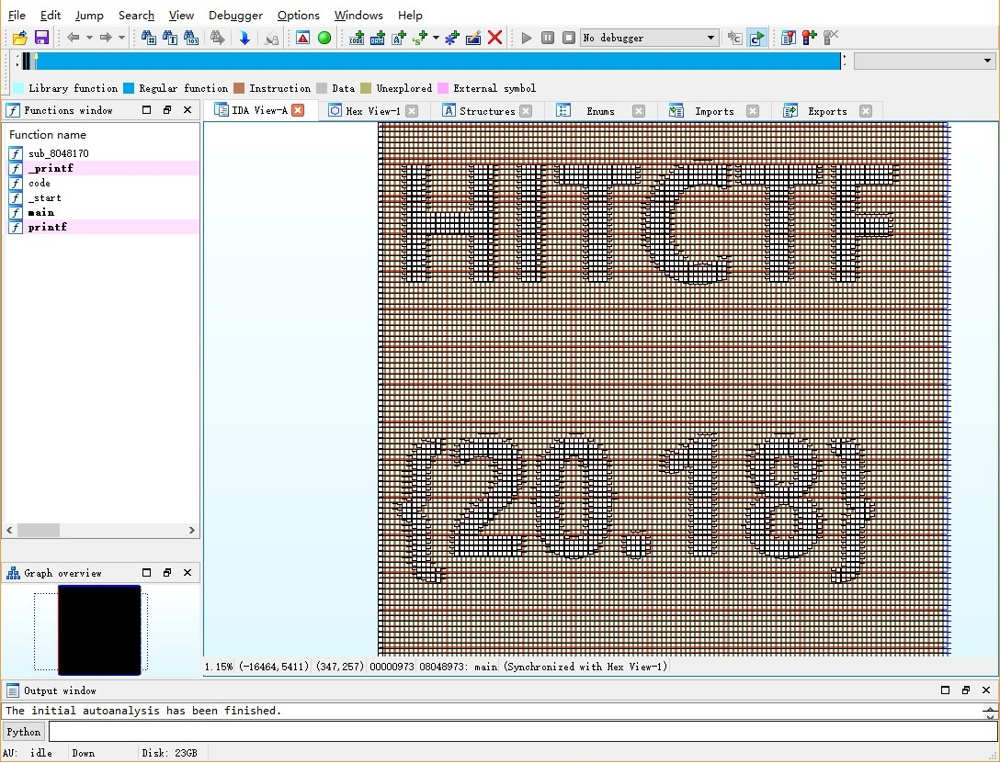

+++
title = "HIT2018新生赛部分WP"
date = 2018-02-03T12:33:00+00:00
updated = 2020-08-07T01:48:37.573723+00:00
description = "HIT2018，2月1、2日的新生赛。"
in_search_index = true

[taxonomies]
tags = [ "CTF", "Misc", "Rev",]
categories = [ "WriteUp",]
archives = [ "archive",]
+++
只会写水题，要好好学习了

<!-- more -->

## Baby Android

安卓逆向助手打开，发现就是异或，两个字符串摘一下异或一下得到flag



## Easy_XOR

发现出题人拿同一个密钥加密了两个文件，而且还有一份明文，直接异或得到flag（所以感觉这个是不是没考中考点？）



## HITCTF 2018签到

不会翻墙学个P的计算机呀，翻墙搜索看视频得到flag



## BaSO4

就是base64/32混合嘛，其实这种混合的一般来说很好解，因为

-    Base64中有[0-9a-zA-Z+/=]
-    Base32中有[A-Z2-7=]
-    Base16中有[0-9A-F]

于是拿出以前写的脚本手动选择跑一下（等有空改成自动的）



## 攻击流量分析

看前面就是尝试找flag未遂，一堆404，拖到最后终于看到200。



把数据保存下来跑一边gzuncompress就好

我是用在线工具搞得，所以为了复制不可见字符先base64一下咯



## 键盘流量分析

首先用命令

```
tshark -r keyboard.pcap -T field -e usb.capdata > usbdata.txt
```

把按键数据抓出来

然后发现只有中间的是8字节的键盘数据，反正也不多就干脆看着敲出来了

用第三个字节查表，首字节的02表示上档键，这个不知道也可以猜出来



## use_your_ida（时间到以后突然想到）

时间到以后群友一说距离视图突然反应过来……

给大佬递IDA.jpg……



算是一种隐写吧，大概