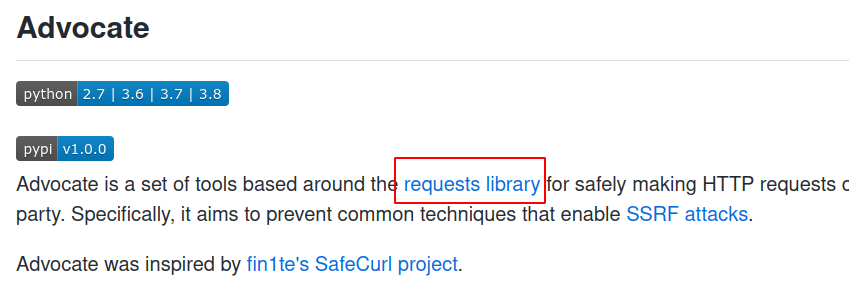
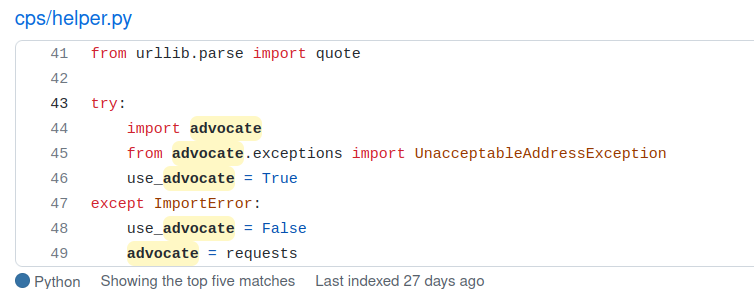

+++
title = "How I deploy Calibre-Web and tweak it"
date = 2022-08-19T01:22:08+08:00
updated = 2022-08-28 03:57:23+08:00
in_search_index = true

[taxonomies]
tags = [ "calibre", "self-host", "proxy", "server", "GFW"]
categories = [ "Notes",]
archives = [ "archive",]
+++

# TL;DR

I managed to host a calibre-web with self signed certificate at non-standard port, and let it fetch metadata through proxy(fuck GFW).

And I found a solution to bulk upload my eBooks onto it.

<!-- more -->

# Originate from an IP

After moving place and settling down, I managed to have a publicly accessable IP. When you have a server, you want an IP. When you have an IP, you want a domain. When you have a domain, wow, you have all the great things on the internet in your pocket(if your server can be that small as a NUC).

So I began to find services that can be deployed on my server through an [awesome-list](https://github.com/awesome-selfhosted/awesome-selfhosted#document-management---e-books). I want a document management server that can:

- access through web
- can fetch metadata by ISBN
- (best to have) user authentication

And that's where I found calibre-web.

I used calibre before, and it's worked perfectly as a desktop software, but it's built-in server just sucks. Maybe my word is too mean, it works as a just adequate E-book reader.

Calibre-web has user management so I can share books with my friends, and I can also get their collections. Calibre supports multiple formats for a book, so I can put source code on it. I can't find a reason stop me choosing it.

# Let's deploy it

I love docker, and thankfully Calibre-web come with a [docker image](https://github.com/linuxserver/docker-calibre-web) built by LinuxServer.io team, and that's where nightmare comes.

This docker image download and install most of its dependencies during build phase, in one `RUN` command, which should be a good practice because it can reduce redundant docker image layers.

But I'm in China, we got a Great Fire Wall to pass. Dependencies can fail for no reason at any download process, curl/apt/pip/etc. So I rewrite the Dockerfile, separate every download process into one `RUN` command, and build it several times.

Image ready, all I need to do is run and see the success log... At least that's what I thought.

For users who want to perform book conversion, they should run docker image with an extra environment variable `DOCKER_MODS=linuxserver/mods:universal-calibre`, which will download it from internet, every f**king time you boot the image.

I know it's not my or thier faults, fuck the GFW and its team, but problem should be solved. I download them and mounted them as docker volume. Finally, it runs successfully!

# Proxies cannot be used with Advocate

Everything was fine, login, admin, uploading. I upload a book and try to fetch metadata from internet, it succeed to fetch data, but failed to save the data. It shows `Error editing book: Proxies cannot be used with Advocate`.

Jesus, I know I'm using a proxy, but if I don't use a proxy, I cannot get access to Google Book, which is crucial for fetching metadata.

I searched on the internel and all I found is a github issue <https://github.com/gshang2017/docker/issues/120> which is absolutely another Chinese fired, a Chinese who faced the same problem as me.

It's 4 am, my mind is blowing, I gave up.

# Read the fucking source code

The day after that day, I remembered that I can check where disable proxy usaga, at least I can write my own service that can be used with a proxy.

Then I found <https://github.com/JordanMilne/Advocate/blob/74594fb8d65c20fd1bf5f2eda75619605d340533/advocate/adapters.py#L31>. Seems that `advocate` just doesn't support proxy. Maybe I can write proxy support for it? I look around and found something interesting in its `README`.



Okey, why can't I replace it with `requests`? I checked`calibre-web` and found . That what I need exactly, so I wrote a small script which can help me replace `advocate` with `requests` and put it into `/config/custom-cont-init.d`:

``` bash
#!/bin/bash

echo "**** patching calibre-web - removing advocate for proxy ****"
sed -i "s/import advocate/raise ImportError(\"no advocate\")/" /app/calibre-web/cps/helper.py
```

Though cover uploads will failed due to absence of `advocate`, but check the error message, it's at <https://github.com/janeczku/calibre-web/blob/68e21e1098aab8dcbfcf024cc296bc43936bfe3c/cps/helper.py#L811>, we can add an environment variable `CALIBRE_LOCALHOST=1` which solve this problem.

# I'll reclaim my lost souls.

Bulk add through web interface seems amazing and complex, so it doesn't have this feature. But remember what I'm using? It's **Calibre**-web, it has the same library structure as Calibre.

I mounted the library folder on my laptop, open library with Calibre and add all my E-book collections into it. 

There's no better thing for both a bibliomaniac and a programmer, looking through all the books on the service I deployed.

# Conclusion

Fuck GFW.

And always remember that source code is your best friend.

# TODO

There is still some improvement to be done, but don't know where to start, I'll update this article as soon as I have done that.
