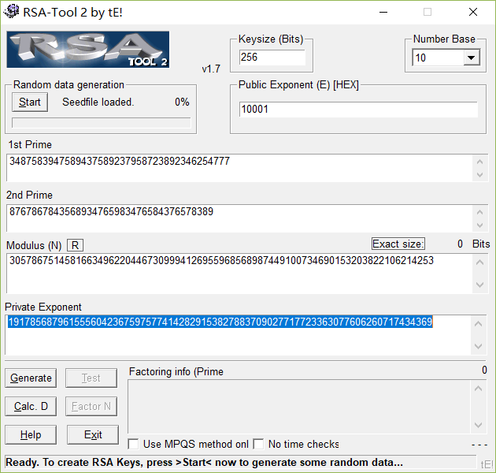
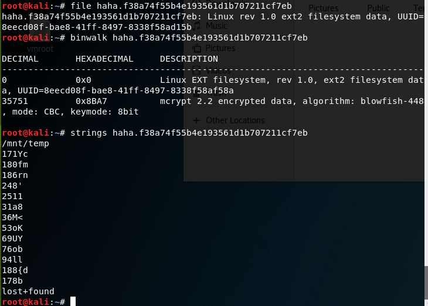
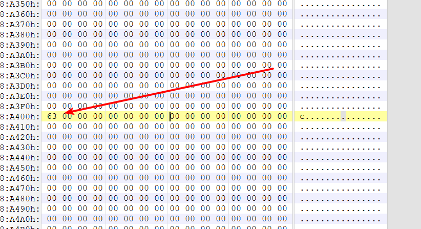
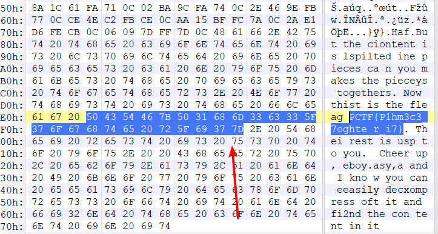
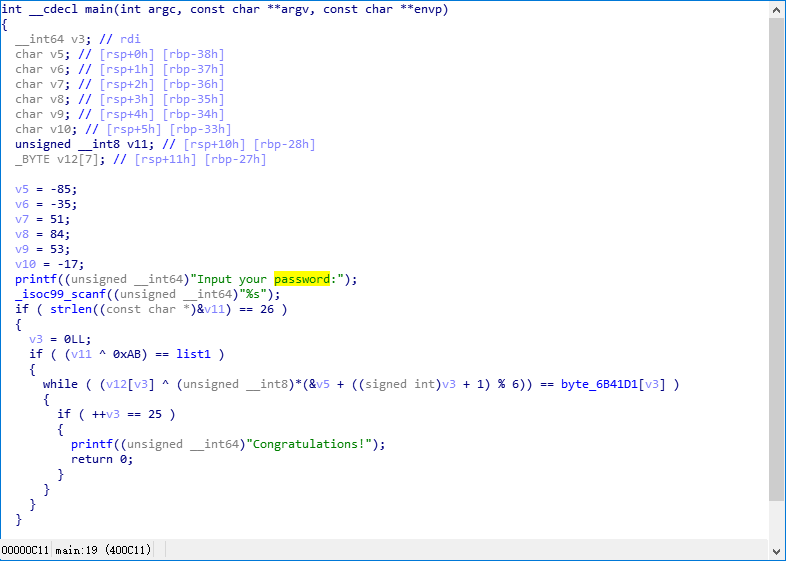
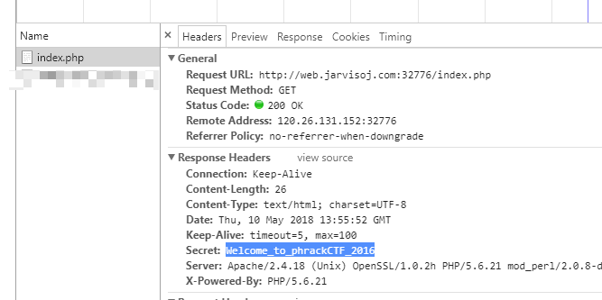
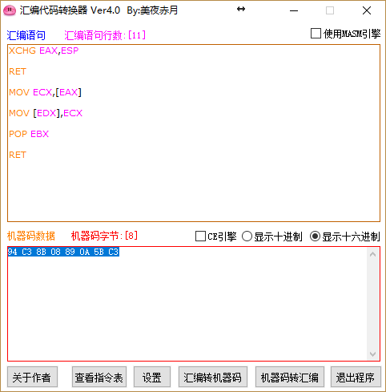
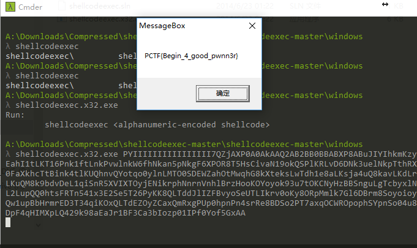

+++
title = "JarvisOJ-WP合集"
date = 2018-05-10T09:11:00+08:00
updated = 2020-08-07T01:54:43.005696+08:00
description = "JarvisOJ-WP合集"
in_search_index = true

[taxonomies]
tags = [ "CTF", "Web", "PWN", "Misc", "Crypto", "Rev",]
categories = [ "WriteUp",]
archives = [ "archive",]
+++

$1因为预感进度表会很长，所以不放了

<!-- more -->
# 不资瓷跳转的进度表

- [x] Basic
    - [x] base64
    - [x] 关于USS Lab.
    - [x] veryeasy
    - [x] 段子
    - [x] 手贱
    - [x] 美丽的实验室logo
    - [x] 神秘的文件
    - [x] 公倍数
    - [x] Easy Crackme
    - [x] Secret
    - [x] 爱吃培根的出题人
    - [x] Easy RSA
    - [x] ROPGadget
    - [x] 取证
    - [x] 熟悉的声音
    - [x] Baby's Crack
    - [x] Help!!
    - [x] Shellcode
    - [x] A Piece Of Cake
    - [x] -.-字符串
    - [x] 德军的密码
    - [x] 握手包
- [x] Crypto
  - [x] Medium RSA
  - [ ] BrokenPic
  - [x] hard RSA

# [Ｘ] Basic

## [Ｘ] base64

注意到没有小写字母和大点的数字，猜测是base32，解完以后是一个十六进制字符串，转ASCII解得

### flag

PCTF{Just_t3st_h4v3_f4n}

## [Ｘ] 关于USS Lab.

搜索得到答案，注意题目里说的是USS Lab。

顺便其实点开about就能看到全称（233

### flag

PCTF{ubiquitous_system_security}

## [Ｘ] veryeasy

打开文件我就知道要用strings命令，但是我就不，我就翻

### flag

PCTF{strings_i5_3asy_isnt_i7}

## [Ｘ] 段子

将锟斤拷存ANSI编码，然后HEX编辑器打开就好

### flag

PCTF{EFBFBDEFBFBD}

## [Ｘ] 手贱

直接解MD5，然后发现说不是标准MD5值，发现长度为33

再看看具体的，发现里面有个$L$的小写，删了解MD5得flag

### flag

PCTF{hack}

## [Ｘ] 美丽的实验室logo

binwalk没有额外东西

但是可以发现不是裸的jpg，strings可以看到Adobe公司工具编辑的痕迹，回去继续

---

不对，用Stegsolver的Frame Browser看到了flag

### flag

PCTF{You_are_R3ally_Car3ful}

##  [Ｘ] veryeasyRSA

RSA-tool直接上啦~




### flag

PCTF{19178568796155560423675975774142829153827883709027717723363077606260717434369}

## [Ｘ] 神秘的文件

file/binwalk指令得到这是一个exT文件系统数据，strings结果也奇怪



索性打开文件看，发现有一堆\x00

但是往下翻发现有些其他东西



然后找到P/C/T，想着能不能移除`\x00`得到flag

然后的确得到了，但是结果失败了



因为错位包括前后错位，所以直接拼凑也是会失败的

看来还是需要文件系统，用命令

`mount -o loop haha.f38a74f55b4e193561d1b707211cf7eb /mnt`

装载文件系统之后，发现每个文件里一个字符，所以写出脚本

```python
import os
s = ""
for i in range(0, 254):
	f = open(str(i), "r")
	s += f.read()
	f.close()
print(s)
```

得到flag

### flag

PCTF{P13c3_7oghter_i7}

## [Ｘ] 公倍数

1s大概做1e8的计算，所以可以直接暴力算就好

代码就没必要放了吧~

### flag

PCTF{233333333166666668}

## [Ｘ] Easy Crackme



算法很简单，第一位异或以后，后面24位每6位一组和对应位置异或，然后进行比较

写出逆算法

```cpp
#include <bits/stdc++.h>
using namespace std;
unsigned char a[27] = {
    0xFB, 0x9E, 0x67, 0x12, 0x4E, 0x9D, 0x98, 0xAB, 0x00, 0x06, 0x46, 0x8A, 0xF4, 0xB4, 0x06, 0x0B,
    0x43, 0xDC, 0xD9, 0xA4, 0x6C, 0x31, 0x74, 0x9C, 0xD2, 0xA0, 0
};
int ar[6] = {-35,51,84,53,-17,-85};
int main()
{
	a[0]^=0xab;
	for(int i=0;i<25;++i){
		a[i+1]^=ar[i%6];
	}
	puts((const char *)a);
    return 0;
}

```


### flag

PCTF{r3v3Rse_i5_v3ry_eAsy}

## [Ｘ]  Secret

打开，F12，网络，刷新，得到



### flag

PCTF{Welcome_to_phrackCTF_2016}

## [Ｘ]  爱吃培根的出题人

提示够明显了，小写字母->A，大写字母->B，[培根密码解密](https://mothereff.in/bacon)

### flag

## [Ｘ] Easy RSA

提示明显

### flag

PCTF{3a5Y}

## [Ｘ] ROPGadget



### flag

PCTF{94C38B08890A5BC3}

## [Ｘ] 取证

搜索得软件名Volatility

### flag

PCTF{volatility}

## [Ｘ] 熟悉的声音

摩尔斯->凯撒

### flag

PCTF{PHRACKCTF}

## [Ｘ] Baby's Crack

很简单的加密，都不用写逆算法了，直接爆破吧！

```c
#include <string.h>
#include <stdio.h>
char a[] = "jeihjiiklwjnk{ljj{kflghhj{ilk{k{kij{ihlgkfkhkwhhjgly";
char b[] = "jeihjiiklwjnk{ljj{kflghhj{ilk{k{kij{ihlgkfkhkwhhjgly";//这里可以为空，我只是方便设置长度搞得
int main()
{
	int len = strlen(a);
	for(int i=0;i<len;++i){
		int ok = 0;
		for(int j=32;j<255&&!ok;++j){
			int cur = j;
			if ( j > 47 && j <= 96 ){
          		j += 53;
        	}else if ( j <= 46 ){
          		j += j % 11;
        	}else{
          		j = 61 * (j / 61);
        	}
        	if(j==a[i]){
        		//ok=1;这里加上注释是为了确认每次解的唯一
        		b[i]=cur;
        		putchar(cur);
        	}
        	j=cur;
        }
        putchar('\n');
    }
    puts(b);
	return 0;
}
```

得到的结果转ASCII就好

### flag

PCTF{You_ar3_Good_Crack3R}

## [Ｘ] Help!!


打开word没有发现flag，binwalk/strings也没有

于是解压word，发现有两张图，OK

### flag

PCTF{You_Know_moR3_4boUt_woRd}

## [Ｘ] Shellcode



### flag

PCTF{Begin_4_good_pwnn3r}

## [Ｘ] A Piece Of Cake

一眼就看出来是单表替换，quip解决

### flag

PCTF{substitutepassisveryeasyyougotit}

## [Ｘ] -.-字符串

一目了然

### flag

522018D665387D1DA931812B77763410

## [Ｘ] 德军的密码


然后解得flag

### flag

WELCOMECISRG

## [Ｘ] 握手包

下载发现是个cap包，中文搜索无果，搜"Kali handshake crack"，搜到hashcat，找到[这个网站](https://hashcat.net/wiki/doku.php?id=cracking_wpawpa2)

照葫芦画瓢

```bash
A:\Downloads\Compressed\hashcat-4.1.0
λ hashcat64.exe -m 2500 9640_1525972232.hccapx rockyou.txt
hashcat (v4.1.0) starting...

* Device #1: WARNING! Kernel exec timeout is not disabled.
             This may cause "CL_OUT_OF_RESOURCES" or related errors.
             To disable the timeout, see: https://hashcat.net/q/timeoutpatch
* Device #2: Intel's OpenCL runtime (GPU only) is currently broken.
             We are waiting for updated OpenCL drivers from Intel.
             You can use --force to override, but do not report related errors.
nvmlDeviceGetFanSpeed(): Not Supported

OpenCL Platform #1: NVIDIA Corporation
======================================
* Device #1: GeForce GTX 965M, 512/2048 MB allocatable, 8MCU

OpenCL Platform #2: Intel(R) Corporation
========================================
* Device #2: Intel(R) HD Graphics 530, skipped.
* Device #3: Intel(R) Core(TM) i7-6700HQ CPU @ 2.60GHz, skipped.

Hashes: 1 digests; 1 unique digests, 1 unique salts
Bitmaps: 16 bits, 65536 entries, 0x0000ffff mask, 262144 bytes, 5/13 rotates
Rules: 1

Applicable optimizers:
* Zero-Byte
* Single-Hash
* Single-Salt
* Slow-Hash-SIMD-LOOP

Minimum password length supported by kernel: 8
Maximum password length supported by kernel: 63

Watchdog: Temperature abort trigger set to 90c

Dictionary cache built:
* Filename..: rockyou.txt
* Passwords.: 14344390
* Bytes.....: 139921496
* Keyspace..: 14344383
* Runtime...: 3 secs

e56452df7244988624af174fa692d81d:560a64ffe917:b8ee65ac640b:Flag_is_here:11223344

Session..........: hashcat
Status...........: Cracked
Hash.Type........: WPA/WPA2
Hash.Target......: Flag_is_here (AP:56:0a:64:ff:e9:17 STA:b8:ee:65:ac:64:0b)
Time.Started.....: Fri May 11 01:17:21 2018 (3 secs)
Time.Estimated...: Fri May 11 01:17:24 2018 (0 secs)
Guess.Base.......: File (rockyou.txt)
Guess.Queue......: 1/1 (100.00%)
Speed.Dev.#1.....:    91621 H/s (10.79ms) @ Accel:32 Loops:16 Thr:1024 Vec:1
Recovered........: 1/1 (100.00%) Digests, 1/1 (100.00%) Salts
Progress.........: 593466/14344383 (4.14%)
Rejected.........: 331322/593466 (55.83%)
Restore.Point....: 0/14344383 (0.00%)
Candidates.#1....: 123456789 -> rinabelle
HWMon.Dev.#1.....: Temp: 68c Util: 98% Core:1151MHz Mem:2505MHz Bus:16

Started: Fri May 11 01:17:04 2018
Stopped: Fri May 11 01:17:25 2018
```

### flag

flag{11223344}

# [　] Crypto

## [Ｘ] Medium RSA

```bash
λ openssl rsa -pubin -in pubkey.pem -text -modulus
WARNING: can't open config file: /usr/local/ssl/openssl.cnf
Public-Key: (256 bit)
Modulus:
    00:c2:63:6a:e5:c3:d8:e4:3f:fb:97:ab:09:02:8f:
    1a:ac:6c:0b:f6:cd:3d:70:eb:ca:28:1b:ff:e9:7f:
    be:30:dd
Exponent: 65537 (0x10001)
Modulus=C2636AE5C3D8E43FFB97AB09028F1AAC6C0BF6CD3D70EBCA281BFFE97FBE30DD
writing RSA key
-----BEGIN PUBLIC KEY-----
MDwwDQYJKoZIhvcNAQEBBQADKwAwKAIhAMJjauXD2OQ/+5erCQKPGqxsC/bNPXDr
yigb/+l/vjDdAgMBAAE=
-----END PUBLIC KEY-----

```

然后分解这个数，用RSAtools输出私钥文件

```bash
λ python rsatool.py -f PEM -o key.pem -p 275127860351348928173285174381581152299 -q 319576316814478949870590164193048 041239
Using (p, q) to initialise RSA instance

n =
c2636ae5c3d8e43ffb97ab09028f1aac6c0bf6cd3d70ebca281bffe97fbe30dd

e = 65537 (0x10001)

d =
1806799bd44ce649122b78b43060c786f8b77fb1593e0842da063ba0d8728bf1

p = 275127860351348928173285174381581152299 (0xcefbb2cf7e18a98ebedc36e3e7c3b02b)

q = 319576316814478949870590164193048041239 (0xf06c28e91c8922b9c236e23560c09717)

Saving PEM as key.pem
```

之后解密

`λ openssl rsautl -decrypt -inkey key.pem -in flag.enc -out flag`

### flag

PCTF{256b_i5_m3dium}

## [　] BrokenPic

### flag

## [Ｘ] hard RSA

 ## RSA 衍生算法——Rabin 算法

 ### 攻击条件

 Rabin 算法的特征在于 $e=2​$。

 ### 攻击原理

> 密文：
>
> $c=m^2\mod n$
>
> 解密：
>
> - 计算出 $m^p$ 和 $m^q$：
>
> $$m_p=\sqrt{c}\mod p$$
>
> $$m_q=\sqrt{c}\mod q$$
>
> - 用扩展欧几里得计算出 $y_p$ 和 $y_q$：
>
> $y_p⋅p+y_q⋅q=1$
>
> - 解出四个明文：
>
> $$a=(y_p⋅p⋅m_q+y_q⋅q⋅m_p)modn$$
>
> $$b=n−a$$
>
> $$c=(y_p⋅p⋅m_q−y_q⋅q⋅m_p)modn$$
>
> $$d=n−c$$
>
> 注意：如果 $$p≡q≡3(mod4)$$，则
>
> $$mp=c^{\frac{1}{4}(p+1)}modp$$
>
> $$mq=c^{\frac14(q+1)}modq$$
>
> 而一般情况下，$p≡q≡3(mod4)p $是满足的，对于不满足的情况下，请参考相应的算法解决。

```python
#!/usr/bin/python
# coding=utf-8
import gmpy2
import string
from Crypto.PublicKey import RSA

# 读取公钥参数
with open('pubkey.pem', 'r') as f:
    key = RSA.importKey(f)
    N = key.n
    e = key.e
with open('flag.enc', 'r') as f:
    cipher = f.read().encode('hex')
    cipher = string.atoi(cipher, base=16)
    # print cipher
print "please input p"
p = int(raw_input(), 10)
print 'please input q'
q = int(raw_input(), 10)
# 计算yp和yq
inv_p = gmpy2.invert(p, q)
inv_q = gmpy2.invert(q, p)

# 计算mp和mq
mp = pow(cipher, (p + 1) / 4, p)
mq = pow(cipher, (q + 1) / 4, q)

# 计算a,b,c,d
a = (inv_p * p * mq + inv_q * q * mp) % N
b = N - int(a)
c = (inv_p * p * mq - inv_q * q * mp) % N
d = N - int(c)

for i in (a, b, c, d):
    s = '%x' % i
    if len(s) % 2 != 0:
        s = '0' + s
    print s.decode('hex')
```


### flag

PCTF{sp3ci4l_rsa}