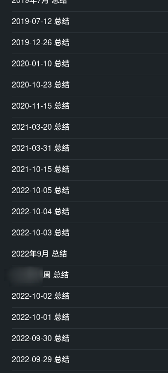
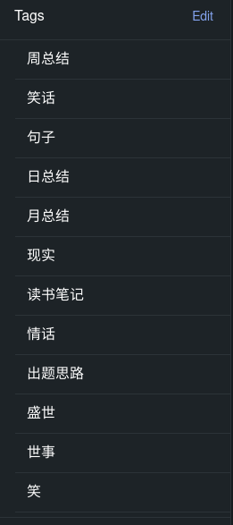
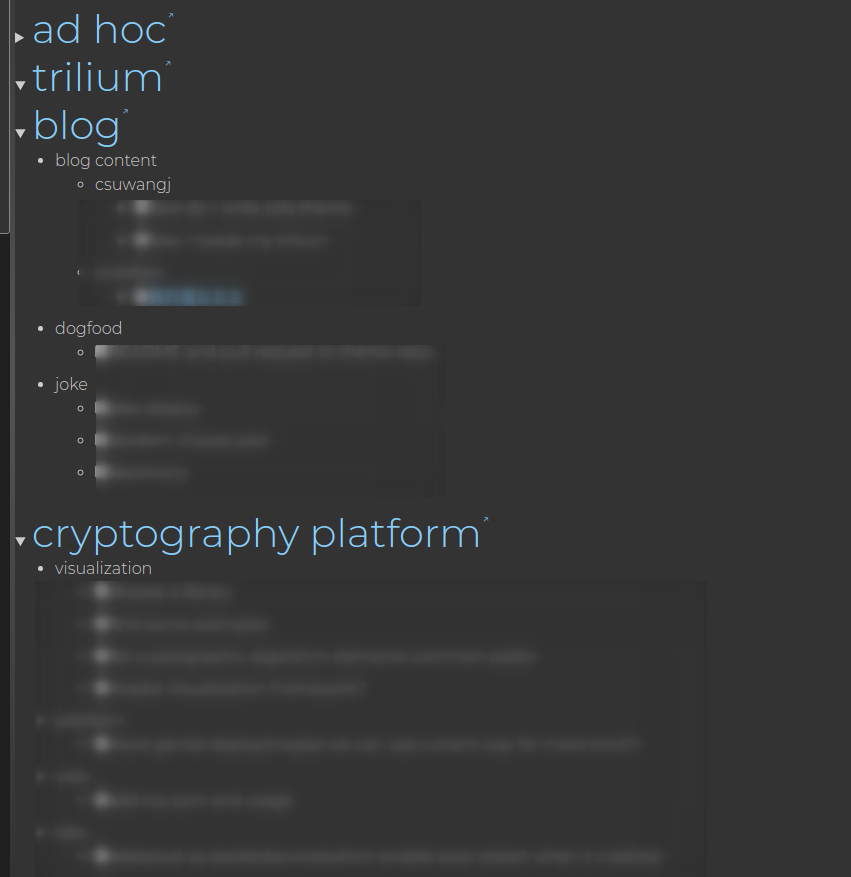

+++
title = "Trilium, My ultimate notebook"
date = 2022-10-10T01:22:08+08:00
updated = 2022-10-10T01:22:08+08:00
in_search_index = true

[taxonomies]
tags = [ "trilium", "self-host", "knowledge base", "notebook"]
categories = [ "Notes",]
archives = [ "archive",]
+++

# TL;DR

I transferred my notes to self-hosted notebook software called [trilium](https://github.com/zadam/trilium), and tried tweaking it to fit me.

I'll list the [pros & cons](#pros-cons) of it in my opinion below.

<!-- more -->

# Background

I used to use simplenote as my notebook, it runs blazing fast, has cloud synchronize and tag system. I used to make it as my diary and notebook for random thoughts.  .

As I grew older and create more and more side projects, I find it's not enough for my daily use. I want a notebook with such features:

- must have:
  - tag system
  - easy to classify and reorder
  - basic markdown support
  - can run as standalone application
  - can import notes from markdown files
- best to have:
  - document template(for my todo list and diary)
  - API support(because I'm a programmer)
  - self-host(I have a private server and public internet access to it)
    - cloud synchronize support(can be native support or through Onedrive/Google Drive)
  - what you see is what you get
    - custom CSS
  - advanced markdown support
    - math formula(LaTeX, mathjax)
    - mermaid diagram
  - handwriting support(I have a Surface)

I tried several notebook software/SaaS like notion/obsidian/logseq/OneNote and none of them satisfy my basic requirements, so I began to try software on <https://github.com/awesome-selfhosted/awesome-selfhosted#note-taking--editors>. Then I found trilium.

# Transfer to trilium

## Make a TODO list is my first TODO

You can get a straight view of how it looks like in its [screenshot tour](https://github.com/zadam/trilium/wiki/Screenshot-tour), or looking through [features list](https://github.com/zadam/trilium#features) to find something interesting, or check [author's opinion towards personal knowledge base](https://github.com/zadam/trilium/wiki/Patterns-of-personal-knowledge-base) to know what will trilium be.

For me, a programmer who loves changing random stuff and seeing what happens, just downloading and trying is my best choice. 

Opening up trilium without server, it will have the demo notes under root folder. They are great examples for me to know what can trilium do and how it is being done.

For me, the most interesting example is weight tracker. I used to have a self-hosted redmine help me manage my side projects, but full real project management software is too heavy to me to use daily. I just develop these packages by myself, all I need is a todo list and a wiki page for every project, and I want these todo lists to also show in a standalone page so I can know I have something to do.

Weight tracker's data is gathered through the notes which has the label "weight". Weight tracker's display is done by using JavaScript library chartjs.

Because I can use JavaScript library in notes, I can literally display anything on the page. Trilium also provide API to fetch note content/title/etc. Which means trilium is a notebook with flexibility as website.

I create a render note and write a script and, Voilà!

Every title is a hyper link navigated to the project's todo note, even the page cannot edit and feed the change back to real todo note, it's good enough for me.

## Label system

Trilium has three special note types for journal: day note, month note, year note. Thanks to my well formatted diary notes title, I can easily write a script to reorganize these notes into the same order as trilium.

But after importing, I still cannot see these notes in trilium's built-in calendar. So I checked the difference between imported diary notes and diary notes created by trilium, and found out that diary notes created by trilium have a label whose value is date.

By default, the exported notes come with a file named `!!!meta.json` containing metadata. I tried to write a script to generate these metadata by hand, and failed. Every note have an ID, and I still don't know what will happen if I random some strings and put them into trilium.

Thank goodness, the flexibility of trilium exceeds my expectations. Finally, I use the bulk action run some script written in 5 minutes on these notes and set the labels.

# end

Now I use trilium on all my digital devices: laptop, desktop, mobile phone, tablet. I think trilium will be the notebook software for my life.

# pros & cons

pros:

1. open source software
1. markdown support
   1. math formula
   2. mermaid diagram
2. handwriting support
3. standalone application(store data locally)
4. can be hosted locally and provide synchronize service for instance runs on other devices
   1. hosted service also provide web access
5. import markdown/html/text
6. appendix support
7. API support with great flexibility
8. what you see is what you get with custom CSS support
9. can export markdown

cons:

1. markdown is not the internal file format
   1. cannot integrate mermaid diagram into notes  
   2. cannot render markdown on the run
2. performance seems not good for too many notes
3. not simple
4. trilium is on beta(means may introduce breaking change in the future)
