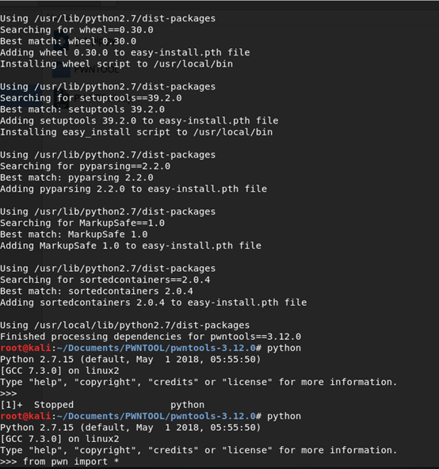

+++
title = "在pip连不上网的时候安装pwntools"
date = 2018-07-21T14:38:02+08:00
updated = 2020-08-07T01:48:37.615611+08:00
description = "本文描述了这样一种特殊情况下安装pwntools的解决方案：有方法联网，但是pip连不上网。"
in_search_index = true

[taxonomies]
tags = [ "PWN",]
categories = [ "Notes",]
archives = [ "archive",]
+++

本文描述了这样一种特殊情况下安装pwntools的解决方案：有方法联网，但是pip连不上网。 

<!-- more -->

解决方法很简单，就是将pwntools和其依赖包下载下来，然后手动安装。选择对应版本，有whl直接下载whl，没有就下载源代码用命令python setup install安装，安装的时候可能会遇到有预先依赖，那就先安装依赖的包就行。 

下图是我在2018年7月22日下载的一套，有需要的度盘链接：https://pan.baidu.com/s/1efC82WX_TdAMoS7aVBFi1w 密码：lnv8

安装效果如下图

