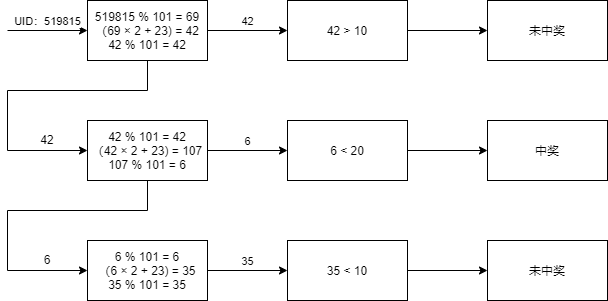

+++
title = "游戏的随机，随机的游戏（一）：当我们讨论伪随机时我们在讨论什么"
date = 2020-05-18T14:14:17+08:00
updated = 2020-08-07T01:54:43.011682+08:00
in_search_index = true

[taxonomies]
categories = [ "None",]
archives = [ "archive",]
+++
我们生活的世界充满了随机，在娱乐时也是。从一次次抽卡、掉落物品，平A转出的暴击，甚至在每一次攻击，背后都有概率的影子。你是否曾看到“计算机里只有伪随机”，又看到有人说“伪随机抽奖机制确保中奖”？他们说的分别是什么？我为什么还抽不到想要的SSR？为什么她17张牌秒了我？

<!-- more -->

其实上面的两句话都是正确的，但是两句话中的“伪随机”说的却不是一个东西：

前者说的是“伪随机数生成器”生成的随机数，生成器就是负责在程序里掷骰子的那个部件。

后一句话“伪随机抽奖机制确保中奖”说的东西在数学上称为“随机数采样”，这种随机来源于电子游戏中以“伪随机分布”而著称的Warcraft3采样算法，所以后来便用伪随机分布来代指这种随机。

为什么有随机数采样这个东西，原因很简单——假如我们只有六面骰子，但是我们所需要的结果却可能是0-100的整数，可能是更大的整数，还可能是小数，将骰子投出的结果转化为最后我们需要的结果，就是采样的意义。当然，什么都不做也可以视作是一种采样，就好像高中我们学过的f(x)=x也是一个函数一样，尽管它什么都没做，但是我们也可以认为它是一种映射关系。

这两种“伪随机”被同时运用到游戏程序中，它们协作的流程大致如下图：

首先程序往往会选定一个或多个用户无法控制的值作为种子，比如当前时间精确到小数点后5位的值，用户是系统里的第几个，接着将种子输入到伪随机数生成器中，之后伪随机数生成器会不断地生成随机数，随机数又经过一重伪随机分布算法后得出最终结果反馈给用户。

举一个例子来说（以下内容为示例，和实际存在的软件、网站无关），某游戏提供给玩家一个抽奖系统，首先它将用户的UID作为初始种子输入到伪随机数生成器；伪随机数生成器的逻辑是，先将种子除以101的余数作为初始状态，在此基础上，每次先用初始状态乘2加23，将结果除101的余数即作为当前产生的结果，也作为下一次产生随机数的初始状态；随后伪随机分布算法运算的逻辑是，若用户是第一次抽奖或者中奖后第一次抽奖，那么若随机数小于等于10，则中奖；若用户不是第一次抽奖并且上次抽奖没有中奖，那么若随机数小于等于20就中奖。我们将获得余数的这个运算用%来表示，于是可以用下图来解释三次抽奖结果：

到这里这一节就完了。随机数除了应用在游戏中，还被应用到我们的通信中，被应用到和我们信息安全切身相关的地方。那么，我们为什么要说“伪”随机数生成器？什么是好的随机数生成器？为什么会有乘2加23的操作？

这些问题就留到下一节来谈吧。上面个用到的算法其实是一个古老而有名的伪随机数生成器——线性同余方法，有兴趣的朋友可以自己先了解。