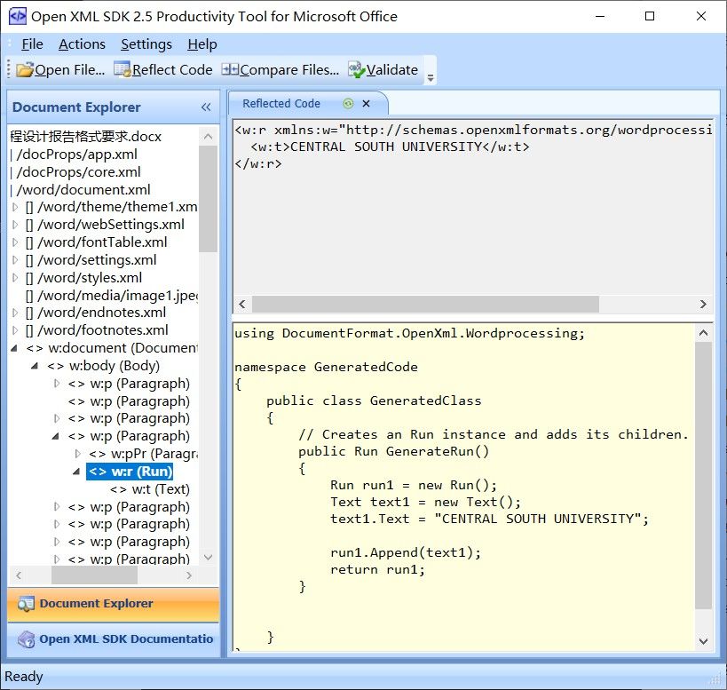
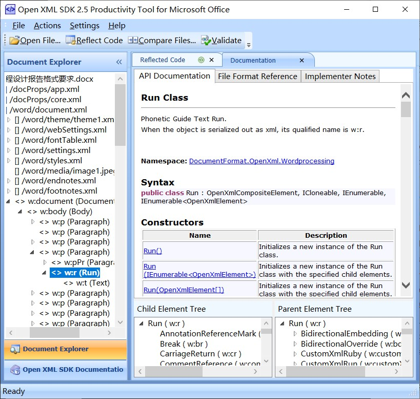

+++
title = "编程是很好玩的--md2docx是怎么写出来的"
date = 2019-08-19T21:18:08+08:00
updated = 2020-08-07T01:54:43.014672+08:00
in_search_index = true

[taxonomies]
tags = [ "Software", "C_sharp", "open_xml_sdk",]
categories = [ "Notes",]
archives = [ "archive",]
+++

花了一个多月写了一个工具，写一点东西帮助想重新造轮子的朋友~

<!-- more -->

我在上个月花了半个月的时间补充相关知识后，在这个月花了几天时间写出了一个将给定 markdown 按照一定格式渲染成 .docx 文件的工具，代码已经开源在[github](https://github.com/CSUwangj/md2docx-csharp)上。但是这个项目目的只是给中南信安学子使用，而且封面格式只按照某个老师的要求来的，如果有定制的需求，还是需要自己动手，那么这里就写一篇文章简单介绍一下完成这个过程中可能用到的资料、工具和可能踩到的坑。

行文中会将用到的资源用超链接放在里面，但为了方便，也会在末尾用[一个列表](#can-kao-zi-liao)把资料列出来。

文章会先介绍 .docx文件和 markdown，是相对比较底层的简单介绍，如果只是关心程序是如何完成的，则完全可以跳过这部分。然后文章会介绍实现里的一些细节，我的实现用了 C#，开发时用的是 Visual Studio，使用的库为 Microsoft.Community.Toolkit（markdown parser）和 Open XML SDK（操作.docx文件）。

# .docx 文件解析

.docx 这个后缀所对应的文件格式全写是 [Office Open XML](https://en.wikipedia.org/wiki/Office_Open_XML_file_formats)。实质上就是一个包含了一系列有一定结构的 xml 文件的zip包，只需修改后缀名就可以用通用的解压软件将其解压并观察到里面的结构。

正如在维基页面所示，Office Open XML 对应了几种文件格式，分别是document, presentation, workbook，也就是我们常说的word, ppt, excel。在 Office Open XML 文件里，会用到几种不同的标识语言，有兴趣的在维基页面可以进一步了解。基于以上信息，不难想到我们最主要需要了解是 Office Open XML document 的文件格式，和其中被大量用到的 WordprocessingML 语言。从这一步开始，维基页面上的内容就比较深入并且主要由各种标准文件组成，从这里开始我推荐从[微软的文档](https://docs.microsoft.com/en-us/office/open-xml/structure-of-a-wordprocessingml-document)或者[officeopenxml.com](http://officeopenxml.com/anatomyofOOXML.php)，如果倾向看视频了解并且不介意英文视频，那么可以考虑[Eric 的博客](http://www.ericwhite.com/blog/introduction-to-wordprocessingml-series/)，他是曾经在微软开发 Open XML SDK 的开发人员，并且离职以后依然在空闲时间继续这方面的工作。在这一节的末尾将会简单介绍 Open XML SDK，在[之后的章节](#bian-cheng-shi-xian)展开介绍。

为了完成我们的目标，Office Open XML 中各组成部分最主要需要关注的是 Main Document、Style Definitions，若是需要页眉、页脚，则还需要 Header、Footer 这两个部分。其他没有提及的内容并非无意义，而只是与目标相关性没有这么高，所以有需要的请自行翻阅文档。剩下不会继续介绍的部分有 Comments、Document Settings、Endnotes、Footnotes、Glossary Document。

Style Definitions 包含了和格式相关的各种东西，仅仅从复用的角度来说，也应当将格式作为存入这里而不是设置一个可以把某一段变成某种格式的函数。具体如何操作这部分的内容来达到我们所需的效果将在[之后](#can-kao-zi-liao)具体说。其中除了寻常可见的各种格式如正文、多级标题之外，还有一种特殊的元素值得留意，就是 latentStyles。Office 内置了相当多的格式（大概200多种），如果每一个格式都将其存放在每一个文档里，显然是没必要的，但是也不能就将其直接删去让软件自己从自己的库里读取，这也就是 latentStyles 起作用的地方。原文说的是

> *延迟样式*引用任何一组已知的应用程序的未包括在当前文档中的样式定义。

Main Document 是一个文档所需的最基本的内容，在里面设置正文的各种内容、格式。这里可以简单介绍的是，正文的最基本的构成内容是 Paragraph，在 xml 中用 \<p\> 节点表示，每个 Paragraph 都会包含对应的段落格式（用 \<pPr\> 节点表示），文字块和一些其他可选的属性。我们直接创建的 word 文档中，段落格式通常是基于某个已有的格式加上一些其他的选项。既然 Paragraph 是以行分隔的，那么具体到中间某些文字需要区别于段落的格式，也就必然需要单独的一个对象来表示，也就是文字块 Run。Run 在 xml 中用 \<r\> 节点表示，其格式用 \<rPr\> 表示。

# markdown 的区别

markdown 是一种标志语言，所谓标致语言，根据维基的说法

> 是一种将文本（Text）以及文本相关的其他信息结合起来，展现出关于文档结构和数据处理细节的计算机文字编码。与文本相关的其他信息（包括例如文本的结构和表示信息等）与原来的文本结合在一起，但是使用标记（markup）进行标识。

既然要处理它，那么我们同样要找到它的标准才行。

但是很可惜，直接叫 markdown 的标准严格意义上并不存在，这里的原因是作者对于在“markdown”这个名字上进行标准的强烈反对，原因是作者认为

> I believe Markdown’s success is *due to*, not in spite of, its lack of standardization. And its success is not disputable.

当然，即便是这样说了，为了继续推广、应用，自然就会有各家做出自己的定义，其中据我了解比较流行的标准有[CommonMark](https://commonmark.org/)和[Github Flavored Markdown(GFM)](https://github.github.com/gfm/)，除此之外，正如 markdown 的发展一样，除了这些标准以外还有许多个人实现的、组织开发的拓展，用于丰富 markdown 的表达形式（所以作者对标准化的反对也可以理解）。

# 编程实现

## 实现思路

要做的东西就是一个 markdown render，就是将 markdown 文档中的每个元素映射到固定的 .docx 文档组成部分。因为已经选定了 Open XML SDK，而最新的只支持 C#，所以问题就是要找个现有的 parser（毕竟我暂时还不想写个 parser 来复习编译原理）。parser 在这个工程中是相当重要的，因为 parser 确定以后，能支持的语法类型定了，markdown 能表达的格式也就定了，表达能力也就有了一个限制。同时这也是我踩的一个大坑，导致增加了之后重构所需的工作量。

## markdown parser

因为搜索时不够细致，我错误地采用了 [Microsoft.Community.Toolkit](https://github.com/windows-toolkit/WindowsCommunityToolkit) 中的 markdown parser，且不提支持的语法不够丰富，最令我无法忍受的是它居然不认为标题的`#`后面需要加个空格！但是当我发现这一点的时候已经晚了，工具已经到了0.9版。

不过也有一个好事，大概可能也许是因为打着微软的名头，尽管是社区维护的包，[文档](https://docs.microsoft.com/en-us/dotnet/api/microsoft.toolkit.parsers.markdown?view=win-comm-toolkit-dotnet-stable)是十分详细的。

简单来说，这个 parser 认为 markdown 由 MarkdownBlock 构成，MarkdownBlock 分为

- CodeBlock
- HeaderBlock
- HorizontalRuleBlock
- LinkReferenceBlock
- ListBlock
- ParagraphBlock
- QuoteBlock
- TableBlock
- YamlHeaderBlock

QuoteBlock 中包含的依然是 Block，如果有用的话会比较难处理；ListBlock 包含的也是 Block，不过我理解来ListBlock 只应该包含列表，所以不算很棘手；YamlHeaderBlock 有且仅有一块并且一定放在头部的位置，获得的是一个`Dictionary<string, string>`；HorizontalRuleBlock 就一水平线； CodeBlock 中只有纯文本，以及编程语言的名称，只要不是想渲染彩色代码，也不难做。LinkReferenceBlock、TableBlock 我没有用到，所以这里掠过。 ParagraphBlock、HeaderBlock 由 MarkdownInline 构成，这里大概可以类比成 .docx 文档里段落和文字块的关系。MarkdownInline 分为

- BoldTextInline
- CodeInline
- EmojiInline
- HyperlinkInline
- ImageInline
- ItalicTextInline
- LinkAnchorInline
- MarkdownLinkInline
- StrikethroughTextInline
- SubscriptTextInline
- SuperscriptTextInline
- TextRunInline

通过以上关系，我考虑得到的结果是下面这个图


处理嵌套、交错的 MarkdownInline 其实挺简单，只需要一个简单的 DFS，遇到新的非 TextRunInline 的话就加上心的格式，然后继续DFS。下面是一个简单的示例代码

```c#
// 输出嵌套的类HTML样子的（伪）渲染效果
static void dfs(MarkdownInline inline)
{
    if (inline is TextRunInline txt)
    {
        Console.Write($"txt{txt.Text}");
    }
    else if (inline is CodeInline code)
    {
        Console.Write($"code{code.Text}");
    }
    else if (inline is BoldTextInline bd)
    {
        foreach(var e in bd.Inlines)
        {
            Console.Write("<Bold>");
            dfs(e);
            Console.Write("</Bold>");
        }
    }
    else if (inline is ItalicTextInline it)
    {
        foreach(var e in it.Inlines)
        {
            Console.Write("<Italic>");
            dfs(e);
            Console.Write("</Italic>");
        }
    }
    else if (inline is StrikethroughTextInline st)
    {
        foreach (var e in st.Inlines)
        {
            Console.Write("<Strike>");
            dfs(e);
            Console.Write("</Strike>");
        }
    }
    else if (inline is SubscriptTextInline ss)
    {
        foreach (var e in ss.Inlines)
        {
            Console.Write("<Subs>");
            dfs(e);
            Console.Write("</Subs>");
        }
    }
    else if (inline is SuperscriptTextInline sp)
    {
        foreach (var e in sp.Inlines)
        {
            Console.Write("<Super>");
            dfs(e);
            Console.Write("</Super>");
        }
    }
}
```


现在处理思路也有了，对应关系也找了，接下来再把操作 .docx 文件解决了这个软件也就完成了。

## Open XML SDK

Open XML SDK 是由微软开发维护的用于在 Office Word, Excel, and PowerPoint 上进行编程的工具，整个 SDK 已经开源在 [github](https://github.com/OfficeDev/Open-XML-SDK) 上。至于文档，则如 README 所言

> The functionality of the specific classes in this version of the Open XML SDK is similar to version 2.5, therefore the [Open XML SDK 2.5 for Office](http://msdn.microsoft.com/en-us/library/office/bb448854.aspx) documentation available on MSDN is still accurate.
>
> In addition to open sourcing of the SDK, Microsoft has opened up the conceptual documentation for public review / contributions. A copy of the documentation is available for you to edit and review [in GitHub](https://github.com/OfficeDev/office-content).

这里要再吹一下 MSDN 的文档，在习惯之后感觉真好用。

有了文档以后还需要一些例子，这里有[微软的例子](https://docs.microsoft.com/en-us/office/open-xml/working-with-paragraphs)，另一个是 [Github上的例子](https://github.com/EricWhiteDev/Open-Xml-PowerTools)。除了这两个以外，一定要强烈推荐的是 Open XML SDK 2.5 Productivity Tool，这个工具通过[微软下载中心](https://www.microsoft.com/en-us/download/details.aspx?id=30425)下载。这个工具可以将现有的 .docx\\.pptx\\.xlsx 文件转换为可以直接生成等价文件的 C# 代码，并且还可以顺便查看对应结构的文档。





于是思路和例子都有了，甚至可以对着抄的例子都有了，接下来需要的东西就是粘合和重构了。

# 其他思路

解析 Markdown 这里自然不必多说，不论已经有的那么多轮子，就算从头写一个 Parser 也不是太大的负担，主要考虑的还是操作 .docx 文件这一重。

Eiric White 在博客中提到了了 [Open XML SDK for JavaScript](http://www.ericwhite.com/blog/open-xml-sdk-for-javascript/)，不过里面相关的资料还有不少在建设当中，不知道具体情况如何。

其次 python 有一个包叫做 [python-docx](https://python-docx.readthedocs.io/en/latest/)，实现了不小的一部分 Open XML 相关的操作，可惜貌似连设置中文字体都需要 hook 到比较底层的实现，不是很优雅的选择，而且没有保障，所以如果需要用到中文建议还是跳过这个选择把（不过看这篇文章的会有非中文文档的需求吗）。

除此之外就剩下两个比较底层的做法：[COM Programming](https://docs.microsoft.com/en-us/windows/win32/com/component-object-model--com--portal) 和 直接操作 XML。

除了原生支持的 VC、VB 以外，已经有多种语言对 COM 做了封装，其中包括比较常见的 [Java](https://sourceforge.net/projects/jacob-project/)、[python](https://pypi.org/project/pywin32/)、[JavaScript](https://www.npmjs.com/package/win32com)。

另一个正如前文所说，.Open XML 文件实质上就是一个包含了一系列有一定结构的 xml 文件的zip包，那么只需要操作多个 xml 文件，最后将其打包也就完成了。如果这里有需求，可以参考 Open XML 相关的文档。各语言大部分都有 zip、xml 相关的库，这里也就不再赘述。

# 后续工作

我自己的软件算是做出了一个 Minimum Viable Product，还有很多不足，接下来我打算利用空闲时间做以下工作。（如果被开了就全职一下，嘤）

- 加入测试（但是目前怎么测试我还没想好，可能参考 Open-Xml-PowerTools 里的测试），顺便重构
- 搭 CI
- 更换 markdown parser
- 将输出格式设置从硬编码改为 json（但是坦白说目前还没想好怎么处理类似封面、页眉、页脚、摘要之类的东西）
- 加入页眉、页脚
- 加入图片、图题
- 加入表格

# 参考资料

- Office Open XML
  - [wikipedia](https://en.wikipedia.org/wiki/Office_Open_XML_file_formats)
  - [Introduction to WordprocessingML Series](http://www.ericwhite.com/blog/introduction-to-wordprocessingml-series/)
  - [微软文档](https://docs.microsoft.com/en-us/office/open-xml/structure-of-a-wordprocessingml-document)
  - [officeopenxml.com](http://officeopenxml.com/anatomyofOOXML.php)
- Markdown
  - [CommonMark](https://commonmark.org/)
  - [Github Flavored Markdown(GFM)](https://github.github.com/gfm/)
  - [Microsoft.Toolkit.Parsers文档](https://docs.microsoft.com/en-us/dotnet/api/microsoft.toolkit.parsers.markdown?view=win-comm-toolkit-dotnet-stable)
  - [Microsoft.Toolkit.Parsers 对应的 Markdown 标准](https://github.com/windows-toolkit/WindowsCommunityToolkit/blob/090542f0fdd0aeeabb6140316ff51da31afdbed2/Microsoft.Toolkit.Uwp.SampleApp/SamplePages/MarkdownTextBlock/InitialContent.md)
- Open XML SDK
  - [GitHub repo](https://github.com/OfficeDev/Open-XML-SDK)
  - [Open XML SDK 2.5 Documentataion](http://msdn.microsoft.com/en-us/library/office/bb448854.aspx)
  - [Microsoft Examples](https://docs.microsoft.com/en-us/office/open-xml/working-with-paragraphs)
  - [Other Examples](https://github.com/EricWhiteDev/Open-Xml-PowerTools)
  - [Open XML SDK 2.5 Productivity Tool](https://www.microsoft.com/en-us/download/details.aspx?id=30425)
- Other
  - [Open XML SDK for JavaScript](http://www.ericwhite.com/blog/open-xml-sdk-for-javascript/)
  - [python-docx](https://python-docx.readthedocs.io/en/latest/)
  - [COM Programming](https://docs.microsoft.com/en-us/windows/win32/com/component-object-model--com--portal)
  - [JACOB - Java COM Bridge](https://sourceforge.net/projects/jacob-project/)
  - [pywin32](https://pypi.org/project/pywin32/)
  - [npm - win32com](https://www.npmjs.com/package/win32com)